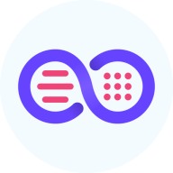

<h1 align="center">
  
   
  Neo Launcher
</h1>

<strong>The modern and feature-rich AOSP-based Launcher!</strong>

  
  
  
  
  

> [!IMPORTANT]
> **This project is not abandoned.** It's just that we (Saul and Antonios) both faced couple of barriers on private life level and technically (on AOSP's side). But the A16-based version is in progress.

## Community :speech_balloon:

You can join either our [Telegram](https://t.me/neo_launcher) or [Matrix](https://matrix.to/#/#neo-launcher:matrix.org) groups to make suggestions, ask questions, receive news, install test builds, or just chat.

## Features :abacus:

### **Some of the main features**

- Rich themes support.
- The Dash.
- Custom search engines.
- Gestures support.
- A unique custom-widget.
- Categories or folders in the app drawer.
- Icon shapes and packs support.
- Customize app icons.
- Desktop grid preference.
- Hide apps.
- Vertical Apps Lists.
- Icons' scaling.
- Back up and restore preferences.

There's also a [developer's document](DEVDOC.md), where the maintainer and collaborators communicate
their TODOs and plans.

## Screenshots :framed_picture:

TODO: update screenshots

<table>
    <tr>
        <td colspan="4"></td>
    </tr>
    <tr>
        <td></td>
        <td></td>
        <td></td>
        <td></td>
    </tr>
</table>

## Contributions

**If you have knowledge in Java or Kotlin you can work on additional features or bugs, and open pull requests. Make sure the code is formatted before make a pull request.**

**You can also contribute to this project by opening issues for bugs or new features.**

## Support

## Translations :left_speech_bubble: 

Contribute your translations to Neo Launcher on [Hosted Weblate](https://hosted.weblate.org/engage/neolauncher/).   Adding new languages is always accepted and supported.

## FAQ

Is QuickSwitch available?

No, it's not, and there is no plans to add it.

## Special Thanks :heart:

Thanks to The LawnchairLauncher team for the great work on Lawnchair.

Thanks to <a href="https://github.com/nonaybay">Rafael Venâncio</a> for creating the F-Droid repo.

To [Donno](https://github.com/Donnnno) for the new app icon base.

Thanks to Helena Zhang and Toby Fried for the great [Phosphor icons](https://phosphoricons.com), which we use since 0.9.0.

### Contributors :handshake:

## Copylefted Libre License :scroll:

Our work is licensed under the [GPLv3+](/COPYING). \
The original AOSP Launcher3 code is licensed under the [Apache License, Version 2.0](https://www.apache.org/licenses/LICENSE-2.0).

Copyright © 2025 [Saul Henriquez](https://github.com/saulhdev), [Antonios Hazim](https://github.com/machiav3lli) and [contributors](https://github.com/NeoApplications/Neo-Launcher/graphs/contributors).

